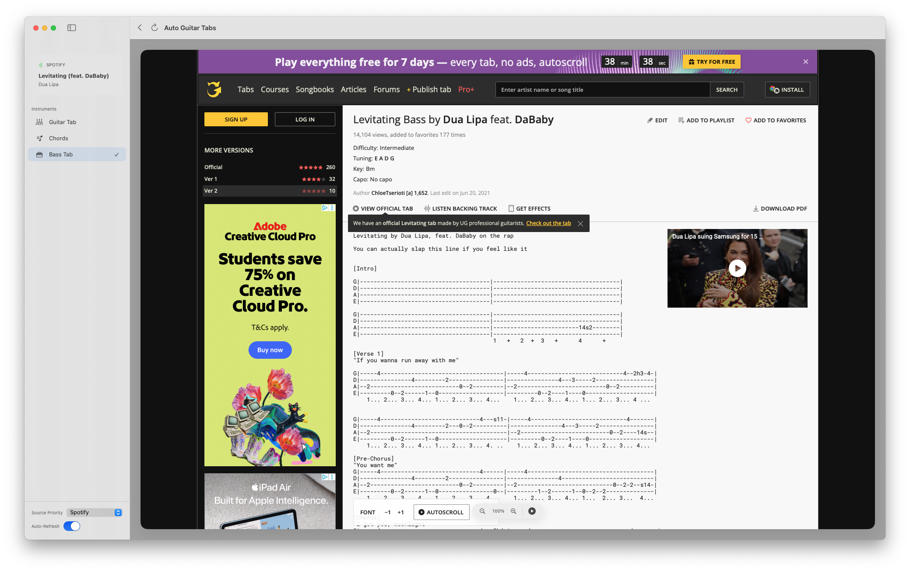

# Auto Guitar Tabs (macOS)

A native macOS application that automatically detects the currently playing song on **Spotify** or **YouTube (Safari)** and opens the corresponding guitar tab from **Ultimate Guitar**.



## Features

- **Automatic Song Sync:** Detects song changes every 3 seconds and refreshes your tab.
- **Smart Filtering:** Automatically skips "Pro" and "Official" results to land on free tabs (Tab, Chords, or Bass).
- **Ad Filtering:** Stays on your current tab when Spotify plays a commercial.
- **Source Priority:** Easily toggle between favoring Spotify or YouTube when both are active.
- **Navigation Controls:** Back and Refresh buttons with "Back button memory" to prevent re-navigation when you manually pick a different tab.
- **Foreground Mode:** Runs with a standard Dock icon and Menu Bar for easy access.

## Requirements

- **macOS:** Tested on macOS 14.
- **Architecture:** Downloads from Releases are built for Apple Silicon (M-series) Macs.
- **Apps:** Spotify desktop app or Safari (for YouTube support).
- **Permissions:** On first run, the app will request permission to control Spotify and Safari via AppleScript.

## How to Install (No Coding Required)

If you just want to use AutoGuitarTabs, download the latest release:

- **[Download AutoGuitarTabs](https://github.com/stanton119/auto-guitar-tabs/releases/latest)**

1.  Unzip `AutoGuitarTabs-<version>-macOS.zip`.
2.  Drag `AutoGuitarTabs.app` into your Applications folder.
3.  First launch: right-click the app and choose **Open**. (macOS shows one
    warning because the app is not notarized — click **Open** to continue.)
4.  Launch AutoGuitarTabs from Launchpad or Applications, and enjoy.

This section is for non-developers. If you want to build or run the app from
source, continue to [How to Run](#how-to-run).

## How to Run

1.  **Clone the Repository:**
    ```bash
    git clone https://github.com/stanton119/auto-guitar-tabs.git
    cd auto-guitar-tabs
    ```

2.  **Run with Swift Package Manager:**
    ```bash
    swift run
    ```
    This will build the app and launch the window.

3.  **Build a Release Version (Optional):**
    ```bash
    swift build -c release
    ./.build/release/AutoGuitarTabs
    ```

4.  **Create a Standalone App Bundle (.app):**
    ```bash
    ./package.sh
    ```
    This will create an `AutoGuitarTabs.app` in your project root that you can double-click or move to your **Applications** folder.

## Usage

1.  **Open Spotify or YouTube in Safari** and start playing a song.
2.  **Launch the App.** It will automatically detect the track and search Ultimate Guitar.
3.  **Handle Captchas:** If Ultimate Guitar shows a captcha, solve it once in the app window. The app will remember your session.
4.  **Auto-Select:** The app will automatically click through to the first free tab it finds. Use the **Back** button if you want to see other results.
5.  **Settings:** Toggle between "Guitar Tab", "Chords", and "Bass Tab" in the top bar.

## Tech Stack

- **SwiftUI:** For the native macOS interface.
- **WKWebView:** For rendering tabs and handling sessions/captchas.
- **AppleScript:** For background song detection.
- **URLComponents:** For robust search encoding.

## License

MIT
